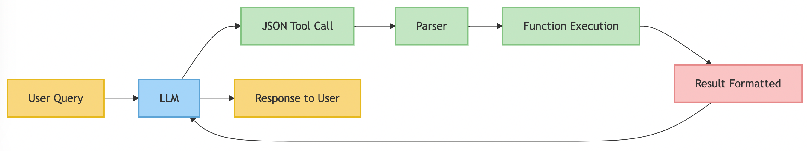
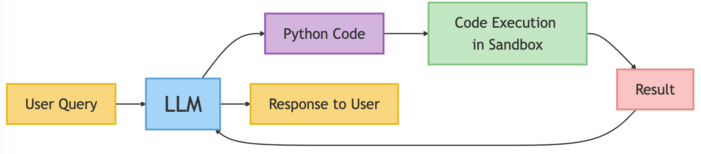

# SmolAgents: A High-Level Guide for Agent Architects

## Introduction

This guide provides an overview of HuggingFace's SmolAgents library, released in December 2024, which represents a significant shift in how agent systems are constructed. We'll explore SmolAgents' architecture, philosophy, and key differentiators from other popular frameworks like [LangChain](../glossary.md#langchain), [LlamaIndex](../glossary.md#llamaindex), and [PydanticAI](../glossary.md#pydanticai).

## What is SmolAgents?

SmolAgents is a lightweight, efficient framework for building AI agents powered by language models. True to its name, SmolAgents emphasizes simplicity and minimalism while maintaining the flexibility needed for sophisticated agent implementations.

### Core Philosophy

- **Minimalism**: Reduce unnecessary abstractions that make frameworks complex to learn and use
- **Efficiency**: Streamlined design for faster development and execution
- **Flexibility**: Support for multiple agency levels and agent types
- **Code-centric**: Direct generation and execution of Python code rather than requiring structured intermediaries

## The CodeAgent Revolution: What Makes SmolAgents Different

The cornerstone of SmolAgents' approach is the [CodeAgent](../glossary.md#code-agent), which fundamentally changes how agents interact with tools and execute actions.

### Traditional Agent Frameworks (LangChain, LlamaIndex)

In conventional frameworks, agents typically:

1. Generate structured outputs (JSON, XML, etc.) that describe which tools to call with what parameters
2. Require an additional layer to parse these outputs and map them to actual function calls
3. Need complex orchestration to manage multi-step reasoning and actions


<!--
User query → LLM generates JSON tool call → Parser interprets JSON → Function execution → Result formatted → Back to LLM replace -> with 

```mermaid
flowchart LR
    User["User Query"] -> LLM["LLM"]
    LLM ==> JSON["JSON Tool Call"]
    JSON ==> Parser["Parser"]
    Parser ==> Function["Function Execution"]
    Function ==> Result["Result Formatted"]
    Result ==> LLM
    LLM ==> Response["Response to User"]
    
    classDef userNode fill:#f9d77e,stroke:#e6b91e,stroke-width:2px
    classDef llmNode fill:#a4d4f9,stroke:#5da4d6,stroke-width:2px
    classDef processingNode fill:#c3e6c3,stroke:#82c482,stroke-width:2px
    classDef resultNode fill:#f9c4c4,stroke:#e68a8a,stroke-width:2px
    
    class User,Response userNode
    class LLM llmNode
    class JSON,Parser,Function processingNode
    class Result resultNode
```
-->

### SmolAgents' CodeAgent Approach

The CodeAgent in SmolAgents:

1. Directly generates executable Python code to perform actions
2. Leverages the full expressiveness of Python (loops, conditionals, variables)
3. Executes code in a controlled environment without intermediate processing layers


<!-- 
User query → LLM generates Python code → Code execution in sandbox → Result returned → Back to LLM

flowchart LR
    %% Increase node and font size
    linkStyle default stroke-width:2px
    
    User["User Query"] ==> LLM["LLM"]
    LLM ==> Code["Python Code"]
    Code ==> Sandbox["Code Execution in Sandbox"]
    Sandbox ==> Result["Result"]
    Result ==> LLM
    LLM ==> Response["Response to User"]
    
    %% Styling with larger font and node sizes
    classDef userNode fill:#f9d77e,stroke:#e6b91e,stroke-width:3px,font-size:24px
    classDef llmNode fill:#a4d4f9,stroke:#5da4d6,stroke-width:3px,font-size:36px
    classDef codeNode fill:#d2b4de,stroke:#9b59b6,stroke-width:3px,font-size:24px
    classDef sandboxNode fill:#c3e6c3,stroke:#82c482,stroke-width:3px,font-size:24px
    classDef resultNode fill:#f9c4c4,stroke:#e68a8a,stroke-width:3px,font-size:24px
    
    class User,Response userNode
    class LLM llmNode
    class Code codeNode
    class Sandbox sandboxNode
    class Result resultNode
-->

## Key Differentiators by Framework

### SmolAgents vs. LangChain

| LangChain | SmolAgents |
|-----------|------------|
| Complex architecture with many abstractions (Chains, Agents, Memory, etc.) | Minimal architecture with focus on agent types and tool integration |
| Steep learning curve due to numerous concepts | Faster learning curve with fewer concepts to master |
| JSON/text-based tool calling | Direct code generation and execution |
| Comprehensive but heavyweight | Lightweight and focused |
| Multiple layers between LLM and action execution | Direct path from LLM to action execution |

### SmolAgents vs. LlamaIndex

| LlamaIndex | SmolAgents |
|------------|------------|
| Primary focus on retrieval and knowledge integration | Broader focus on flexible agent behaviors |
| Query engine abstraction as central concept | Code generation as central concept |
| Complex query planning and optimization | Straightforward code-based task execution |
| Specialized for RAG applications | General-purpose agent framework |
| Structured tool calling patterns | Flexible code-based approach |

### SmolAgents vs. PydanticAI

| PydanticAI | SmolAgents |
|------------|------------|
| Type-driven development using Pydantic schemas | Code-driven development with Python functions |
| Structured data validation focus | Programming flexibility focus |
| Reaction to LangChain complexity | Different approach to simplification |
| Type-safe tool interfaces | Dynamic code generation |
| JSON structured outputs | Direct Python code execution |

## Agency Levels in SmolAgents

SmolAgents provides a spectrum of agency levels, allowing developers to choose how much autonomy to grant their agents:

1. **Level 0-1**: Basic decision-making without significant control
2. **Level 2-3**: Function calling and simple workflow control
3. **Level 4**: Starting other agentic workflows
4. **Level 5**: Generating and executing new code (CodeAgent)

## Implementing Tools for SmolAgents

Tools in SmolAgents are implemented as Python functions with clear documentation:

```python
@tool
def search_knowledge_base(query: str) -> str:
    """
    Search the knowledge base for information related to the query.
    
    Parameters:
    query (str): The search query to look for in the knowledge base
    
    Returns:
    str: The relevant information found in the knowledge base
    """
    # Implementation here
    pass
```

## The ReAct Framework in SmolAgents

SmolAgents supports the ReAct (Reasoning + Acting) framework, which interleaves:

1. **Reasoning**: LLM generates thinking steps to plan approach
2. **Acting**: Agent executes relevant tools or code
3. **Observing**: Agent processes results and updates its understanding

This interleaved approach produces better results than separating reasoning from acting.

## Integrating with Local LLM Deployment

SmolAgents works seamlessly with local LLM deployments like Ollama:

```python
from smolagents.models import Model
from smolagents import CodeAgent

# Create Ollama model (e.g., DeepSeek R1)
model = Model(name="ollama/deepseek-r1:7b")

# Create a CodeAgent using this model
agent = CodeAgent(model=model, tools=[...])
```

## Safety Considerations with CodeAgent

The power of code generation comes with responsibility. SmolAgents provides:

1. **Controlled Imports**: Limiting which modules the agent can access
2. **Sandboxed Environments**: Isolating code execution from the main system
3. **Execution Limits**: Preventing infinite loops or resource exhaustion

## Multi-agent Systems with SmolAgents

SmolAgents can be used to build systems of specialized agents that work together:

1. **Coordinator Agent**: Manages overall task flow and delegation
2. **Specialist Agents**: Focus on specific domains or capabilities
3. **Tool-sharing**: Agents can share access to common tools

## Getting Started with SmolAgents

Basic implementation steps:

1. **Install the library**: `pip install smolagents`
2. **Create a model**: Connect to local or remote LLM
3. **Define tools**: Create functions with `@tool` decorator and docstrings
4. **Choose agent type**: Select appropriate agent class based on needed capabilities
5. **Run the agent**: Connect agent to user input and process responses

## Real-world Applications

SmolAgents is particularly well-suited for:

- **Code generation and execution**: Software development assistance
- **Data analysis and visualization**: Working with data through code
- **Autonomous workflows**: Complex multi-step processes
- **Educational systems**: Intelligent textbooks and learning assistants
- **Research assistants**: Literature review and experiment design

## Conclusion

SmolAgents represents a paradigm shift in agent architecture, emphasizing code generation and execution over structured intermediaries. While frameworks like LangChain, LlamaIndex, and PydanticAI offer valuable capabilities, SmolAgents' unique approach provides an efficient, flexible alternative that may be better suited for many agent applications, especially those involving code generation or complex workflows.

By adopting a code-centric approach and minimizing unnecessary abstractions, SmolAgents enables developers to build powerful agent systems with less overhead and complexity, making it an important tool in the modern agent architect's toolkit.