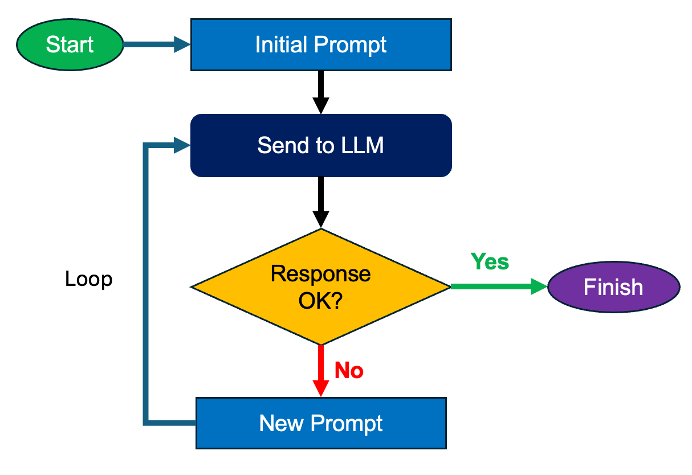
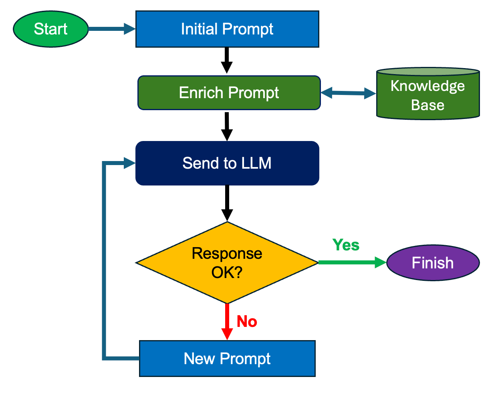
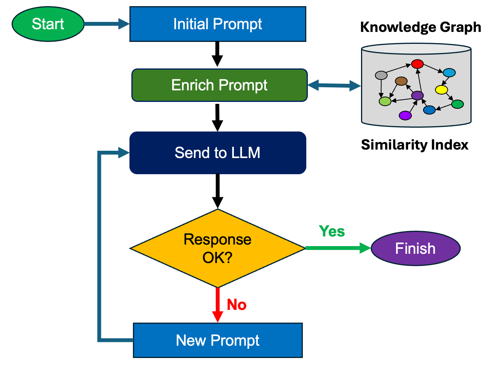
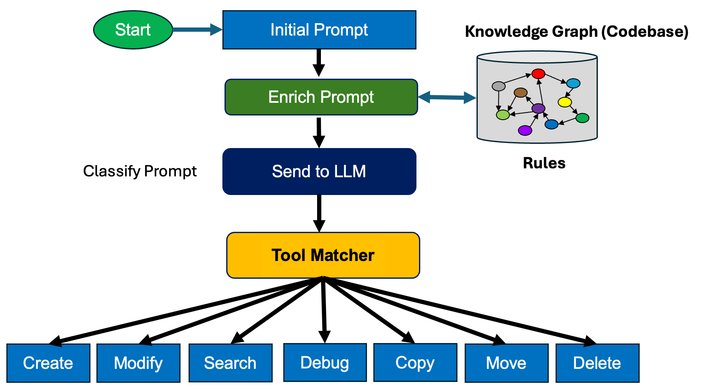
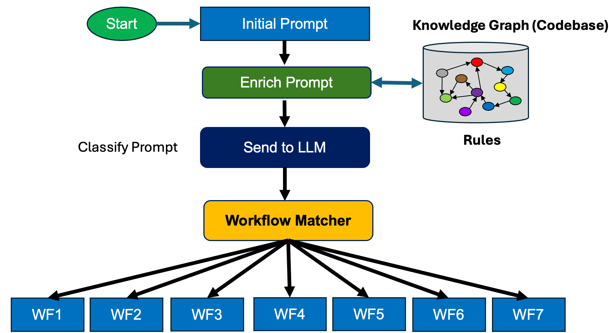

# Agentic Workflows

Here is a brief overview of the key workflows we use when building intelligent agents.

## Overview

## Prompt Iteration

- The LLM is trained on public knowledge but does not know anything about your goals, your products or your customers 
- A human decides if the response is OK
- The human is “trained” to write better prompts

## Prompt Enrichment from Knowledge Base (RAG)

- In this model, we enrich your prompt with content from
a local knowledge based.
- The key to enrichment is to find the right content related
to the question in your prompt.
- Enriching your prompt with local knowledge is much more cost effective than fine tuning your own language model.

## Prompt Enrichment from Knowledge Graph

- In this workflow we replace the generic knowledge based with a knowledge graph that has similarity indexes on reinvent components
- Knowledge graphs store models of the real world with better precision than tabular data such as CSV files or flat files with per-query relational JOIN operations

## Matching a Developer Request to a Developer Tool

## Matching a Developer Request to a Workflow

Remember that workflows are graphs!