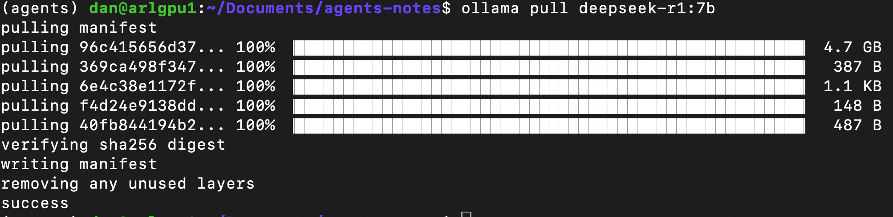

# Ollama Deepseek Setup

This is an example of installing Ollama and the DeepSeek R1 7b model
on my local system that has a NVIDIA RTX 2070 GPU with 12GB RAM.

## Install Ollama
```sh
curl -fsSL https://ollama.com/install.sh | sh
```

## Test Ollama

```sh
ollama --version
```

Response:

```
ollama version is 0.3.6
```

## Setup Ollama as a UNIX service

```
sudo systemctl edit ollama.service
```

Add the following lines:

```
[Service]
Environment="OLLAMA_HOST=0.0.0.0"
Environment="OLLAMA_ORIGINS=*"
```

## Test the Ollama REST Service

```sh
curl http://localhost:11434/api/version
```

Result:

```
{"version":"0.3.6"}
```

## Ollama Shell Commands

```sh
ollama --help
```

```
Large language model runner

Usage:
  ollama [flags]
  ollama [command]

Available Commands:
  serve       Start ollama
  create      Create a model from a Modelfile
  show        Show information for a model
  run         Run a model
  pull        Pull a model from a registry
  push        Push a model to a registry
  list        List models
  ps          List running models
  cp          Copy a model
  rm          Remove a model
  help        Help about any command

Flags:
  -h, --help      help for ollama
  -v, --version   Show version information

Use "ollama [command] --help" for more information about a command.
```

## Download DeepSeek-r1

You can download the full 7b model by adding the keyword ```pull``` and the model name to ollama.

```sh
ollama pull deepseek-r1:7b
```



## Test that Deepseek-r1 7B is working

```sh
ollama run deepseek-r1:7b
>>> /show info
  Model                          
  	arch            	qwen2 	         
  	parameters      	7.6B  	         
  	quantization    	Q4_K_M	         
  	context length  	131072	         
  	embedding length	3584  	         
  	                               
  Parameters                     
  	stop	"<｜begin▁of▁sentence｜>"	  
  	stop	"<｜end▁of▁sentence｜>"  	  
  	stop	"<｜User｜>"             	  
  	stop	"<｜Assistant｜>"        	  
  	                               
  License                        
  	MIT License                	    
  	Copyright (c) 2023 DeepSeek	    
  	                            
>>> what are the 10 most difficult concepts in high-school geometry to understand?
```

## DeepSeek Response

### Thinking
<think>
Okay, so I need to figure out what the top 10 most difficult concepts in high school geometry are. Hmm, where do I start? I've taken geometry before, but it's been a while, so some of these might have faded from my 
memory. Let me think step by step.

First off, when I was learning geometry, one topic that always confused me was proofs. There were so many theorems and properties to remember, and constructing a logical argument seemed like a whole other language. I can't even recall exactly what an auxiliary line is, but I know it's used in proofs somehow.

Then there are circles. I remember they have circumference, area, radius, diameter, and all those formulas, but when you start talking about angles subtended by chords or tangents, things got really tangled for me. It was hard to keep track of the different theorems related to circles, like the inscribed angle theorem or 
something.

Triangles are another big topic in geometry. There are so many types—scalene, isosceles, equilateral—and each has its own properties. Then there's Pythagoras' theorem for right-angled triangles, which I sometimes mixed 
up with other formulas because they all looked similar. Also, triangle congruence and similarity were confusing at times; remembering SAS and ASA rules was a struggle.

Coordinate geometry also tripped me up. It combines algebra and geometry, so you have to visualize shapes on the coordinate plane and use equations to find distances, slopes, and intersections. I remember struggling with finding the distance between two points using the distance formula and calculating midpoints or perpendicular lines.

Transformations like translations, rotations, reflections, and dilations were another area where I had trouble. Understanding how figures change position or size on the coordinate plane was confusing without a clear visual. Also, similarity transformations confused me because they involved scaling, which adds another 
layer of complexity.

Trigonometry in geometry felt separate from what I had learned before. Learning sine, cosine, and tangent functions to find side lengths and angles in right triangles was initially tough. Then, when we moved on to 
the unit circle, everything shifted, and it became even more abstract. I had trouble understanding how trigonometric ratios extended beyond right triangles.

Three-dimensional geometry confused me a lot. Moving from 2D shapes to 3D solids like prisms, pyramids, cylinders, cones, and spheres introduced new concepts and formulas. Calculating surface area and volume required knowing which formula to apply when, and I often mixed them up or used the wrong dimensions in 
calculations.

Parallelograms had their own set of properties that needed to be memorized for proofs. Proving whether a quadrilateral was a parallelogram based on given information was tricky because there were multiple ways to 
show it, like using opposite sides equal or parallel lines and angles.

Probability in geometry was another point where I struggled. It wasn't just basic probability; integrating geometric principles made the problems more complex. Calculating probabilities based on areas or lengths required a good understanding of both geometry and probability concepts.

Lastly, constructions with a compass and straightedge were a nightmare. It involved precise steps without any measurements, which felt restrictive. Forgetting a step in a construction could lead to an incorrect figure, and figuring out the right sequence without trial and error was frustrating.

Wait, did I miss anything? Let me think... Maybe locus problems where you have to find points satisfying certain conditions. Or maybe transformations again; they were mentioned before but perhaps not explicitly listed as top 10. Hmm, since it's about difficulty, maybe those are already covered.

I should also consider if the order makes sense. Proofs seem foundational but can be really challenging because they require logical reasoning. Then coordinate geometry and constructions build on previous knowledge with algebra and precise drawing skills. Trigonometry and circles add layers of complexity with their formulas and applications. Three-dimensional geometry might come last as it's more abstract.

Yeah, I think that covers the main areas where students usually struggle in high school geometry. Each topic has its own challenges, but some require a strong foundation in other areas like algebra or logical reasoning.
</think>

### Answer
The top 10 most difficult concepts in high school geometry can be categorized based on their complexity and the skills they require:

1. **Geometric Proofs**: Constructing logical arguments using axioms and previously proven theorems is challenging due to its abstract nature.

2. **Circle Theorems**: Understanding properties of circles, such as angles subtended by chords, tangents, and arcs requires memorization and application of multiple theorems.

3. **Triangle Properties and Congruence/Similarity**: Distinguishing between different types of triangles and applying congruence/similarity rules (e.g., SAS, ASA) can be confusing.

4. **Coordinate Geometry**: Combining algebra with geometry to find distances, slopes, and intersections on the coordinate plane is complex.

5. **Transformations**: Grasping concepts like translations, rotations, reflections, and dilations, especially their effects on figures in the coordinate plane, is challenging.

6. **Trigonometry**: Extending trigonometric ratios beyond right triangles using the unit circle abstracts the subject and complicates problem-solving.

7. **Three-Dimensional Geometry**: Calculating surface areas and volumes of 3D solids like prisms and pyramids requires applying specific formulas with attention to detail.

8. **Parallelogram Properties**: Proving properties of parallelograms based on given information involves multiple proof strategies.

9. **Geometric Probability**: Integrating probability concepts with geometric principles, such as area-based calculations, adds complexity.

10. **Compass and Straightedge Constructions**: Performing precise constructions without measurement tools demands careful step-by-step execution.

Each concept builds upon previous knowledge, requiring a blend of logical reasoning, algebraic skills, and spatial understanding. Mastery often necessitates practice and a solid grasp of foundational topics.
>>>

## Other Ollama Commands

>>> /help
Available Commands:
  /set            Set session variables
  /show           Show model information
  /load <model>   Load a session or model
  /save <model>   Save your current session
  /clear          Clear session context
  /bye            Exit
  /?, /help       Help for a command
  /? shortcuts    Help for keyboard shortcuts

Use """ to begin a multi-line message.